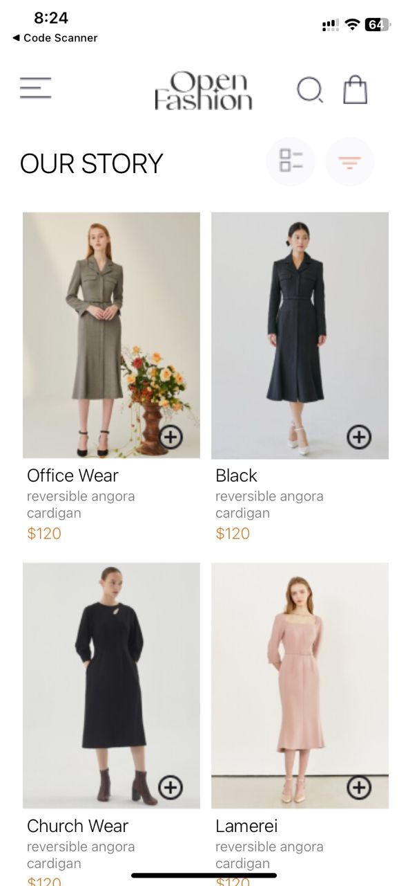
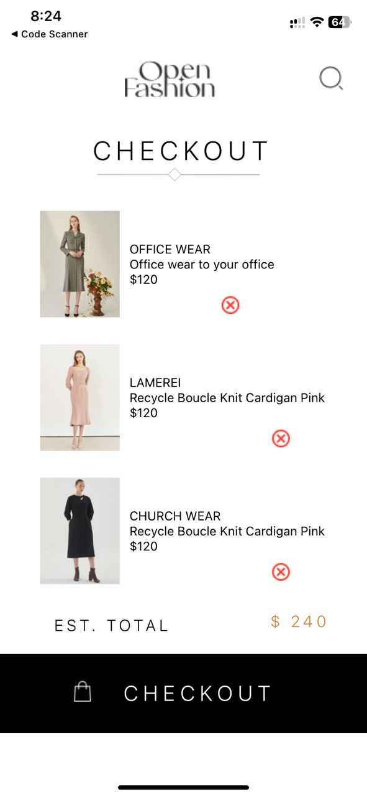

# rn-assignment6-11245046

## Homescreen

This React Native component creates a header section for a mobile app.
The header includes two main sections:
a top area with a logo and a search icon, and a bottom area with checkout text and a decorative line image.
The component utilizes React Native’s built-in View, Image, and Text components,
and defines styles using the StyleSheet API to manage layout and appearance.

## Clothes Component:
Displays a grid layout of products.
Each product is represented by a ProductCard component.
The ProductCard includes the product’s image, name, description, price, and an “Add to cart” button.
Products are stored in an array and mapped to individual ProductCard components.
## OurStory Component:
Features a title: “OUR STORY.”
Includes two circular images.
Displays a list view icon and a filter icon.

### Screenshots

